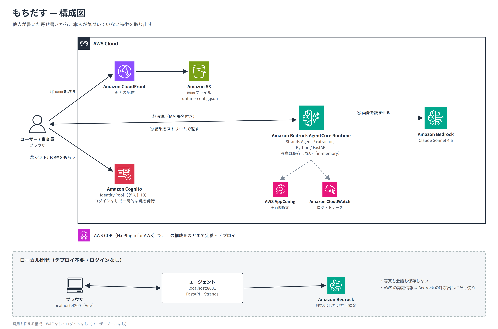

# もちだす

> **自分を説明する言葉は、もう誰かが書いている。**

卒業アルバムの寄せ書き、退職のときの色紙、職場でもらったサンクスカード。他人があなたについて書いた紙は、たいてい実家に置いたままです。

もちだすは、その写真から「**時期も場所も違う人たちが、別々に同じことを書いていた**」特徴を取り出します。本人が当たり前すぎて、自己紹介には書かないような特徴です。取り出す言葉はすべて原文のままで、AI が本人を言い換えて評価することはありません。

AWS Builder Center「Zero to Shipped」ハッカソンの応募作です（`#personal-expression`・`#startup`、締切 2026-10-02 23:59 PDT）。

**試す：** https://d1x77t2z0ibnhe.cloudfront.net/ （ログインなし）・サンプルの結果：https://d1x77t2z0ibnhe.cloudfront.net/sample

画面は日本語と英語に対応しています（右上のボタン、または URL に `?lang=ja` / `?lang=en`）。引用は、書かれた言葉のまま翻訳しません。

---

## 1. 使い方

1. **読み込む**：寄せ書きやカードの写真（JPEG か PNG、最大6枚。iPhone の HEIC は Safari なら読めます）を選び、写真ごとに「紙の種類」と「何年前にもらったか」を入れます。ピアボーナスや Slack の感謝のメッセージを貼り付けることもできます。
2. **捨てる**：Amazon Bedrock の Claude が1人分ずつに分け、具体的な言葉だけを残します。定型の挨拶や内輪ネタは外します。
3. **つなぐ**：**2人以上が別々に触れている特徴**を「あなたが当たり前だと思っていること」として出します。根拠の引用を時期の古い順に並べ、最近の似た経験を思い出すための問いかけを添えます。強みの候補の名前と問いかけは画面の言語で書き、引用は翻訳しません。
4. **持ち出す**：残した言葉を、いつ・どの紙かを付けたテキストとしてコピーします。

サンプルは、架空の人物「佐藤 陽」さん宛の寄せ書きやカード5種です（41件のうち10件を残す）。トップの「サンプルの結果を見る」（`/sample`）から、ログインなしで見られます。使い方の説明は `/how` にあります。

## 2. やらないこと

| やらないこと | 仕組み |
|---|---|
| 言い換え・要約 | 貼り付けた文章から取った言葉は、原文に含まれているかをプログラムで照合し、一致しないものは捨てる（`verify.py`） |
| 1人しか言っていないことを強みにする | 書き手が2人未満の候補は、プログラムで落とす（`verify.py`） |
| 写真や文章の保存 | アカウントもデータベースもなく、エージェントは会話履歴を持たない（in-memory）。結果はブラウザのタブの中だけにある |
| 自己PR文を代わりに書く | 根拠と問いかけまで。話す言葉は本人が作る |

## 3. 構成



1. ブラウザが CloudFront から画面を取得します。
2. Cognito Identity Pool（Basic フロー）と STS から、ログインなしでゲスト用の一時的な鍵を受け取ります。この鍵でできるのは、エージェントを呼ぶことだけです。
3. 写真を長辺 2000px の JPEG に縮小し、IAM 署名を付けて AgentCore Runtime に送ります。
4. Strands Agent が Claude Sonnet 4.6 に読ませ、構造化出力（`fragments` と `traits`）で受け取ります。そのあと `verify.py` で決まりごとに合わせます。
5. 結果をストリームでブラウザに返します。何も保存しません。

## 4. 使用技術

| 分類 | 技術 | 用途 |
|---|---|---|
| 土台 | Nx Plugin for AWS（`@aws/nx-plugin` 1.0.2）、Nx、pnpm、uv | 雛形の生成、モノレポのタスク実行 |
| 画面 | React + Vite、TanStack Router、Tailwind CSS、shadcn/ui | 入口・読み込む・結果・サンプル・使い方の5画面。日本語と英語 |
| 画面 → エージェント | 自動生成クライアント（OpenAPI から）、aws4fetch | 型付きの呼び出しと、ゲスト用の鍵での IAM 署名（`useSigV4.tsx`） |
| エージェント | Python 3.14、Strands Agents、FastAPI、Pydantic | 画像入力、構造化出力、原文照合 |
| モデル | Amazon Bedrock（Claude Sonnet 4.6） | 手書きの読み取りと判定（`MOCHIDASU_MODEL_ID` で変更可） |
| 実行基盤 | Amazon Bedrock AgentCore Runtime | エージェントの実行（IAM 認証） |
| 配信 | Amazon CloudFront + S3 | 画面の配信（非公開バケット、OAC、Content-Security-Policy） |
| アクセス | Amazon Cognito Identity Pool、AWS STS | ログインなしのゲスト ID（Basic フロー） |
| 設定 | AWS AppConfig | エージェントの実行時設定 |
| IaC | AWS CDK、checkov | 1つのスタックで定義、ビルド時にセキュリティチェック |

費用を抑えるため、WAF・ユーザープール・データベースは使いません（理由は `docs/decisions.md`）。

## 5. 開発で使ったコーディングエージェント

- **Claude（Cowork）**：設計、デザインからの画面実装、日本語・英語の切り替え、エージェントと照合処理、テスト、開発者のブラウザを操作しての不具合の調査。たとえば次の原因を特定しました。
  - iPhone の HEIC 写真を Chrome で読めない
  - Identity Pool の標準（Enhanced）フローのゲストの鍵には AWS のスコープダウンポリシーが付き、`bedrock-agentcore:InvokeAgentRuntime` が許されない（Basic フロー + STS に変更）
  - 画面の Content-Security-Policy が `blob:` の画像を禁止していて、本番で写真を縮小できない
- **Claude Code + AWS MCP Server（Agent Toolkit for AWS）**：AWS へのデプロイと運用。AgentCore Runtime の CloudWatch ログから、配布物の起動スクリプトが開発者の手元の Python を指していたことを突き止めました（ビルド時に `scripts/fix_shebangs.py` で修正）。`--express` のデプロイで `UPDATE_FAILED` から抜けられなくなったスタックの復旧も行いました。
- **Nx Plugin for AWS の MCP サーバー**：雛形の生成。

## 6. 動かし方

前提：Node.js 22 以上、pnpm 10、uv 0.9 以上、Python 3.14 正式版、Bedrock で Claude Sonnet 4.6 を使える AWS 認証情報。

```bash
pnpm install
uv sync --all-packages

# ローカルで動かす（デプロイ不要・ログインなし。課金は Bedrock の呼び出しだけ）
export AWS_PROFILE=<プロファイル> AWS_REGION=<Claude を有効にしたリージョン>
pnpm nx dev @mochidasu/web          # 画面 :4200、エージェント :8081

# ビルドとデプロイ
pnpm build                          # lint・型チェック・テスト・バンドル・cdk synth・checkov
pnpm nx bootstrap @mochidasu/infra  # 初回のみ
pnpm nx deploy-sandbox @mochidasu/infra
pnpm nx destroy-sandbox @mochidasu/infra   # 片付け
```

詳しい手順とトラブル対応は [docs/development.md](docs/development.md) にあります。

## 7. リポジトリの中身

```
packages/
  web/src/
    routes/            index（入口）・upload（読み込む）・result（結果）・sample（サンプル）・how（使い方）
    components/site/   ヘッダー、強みの候補（Insight）
    lib/               reading（データの形）・format（集計・整形）・image（縮小）・i18n（日本語・英語の文言）
    demo/sample.ts     サンプルのデータ（架空の人物宛）
    generated/         エージェントのクライアント（自動生成・編集しない・git 管理外）
  agent/mochidasu_agent/extractor/
    schema.py          入出力の型（正）
    agent.py           指示文とモデル設定
    main.py            /invocations の処理
    verify.py          原文照合と、強みの候補の絞り込み
  infra/src/stacks/application-stack.ts
  common/constructs/   CDK 部品（GuestIdentity・Extractor・Web など）
docs/
  concept.md           コンセプトと抽出ルール
  decisions.md         決めたことと理由
  development.md       開発・デプロイ・トラブル対応
  architecture/        構成図（日・英）
```

## 8. この先

- 手書きの切り抜き：写真から1人分ずつ切り出し、その人の字のまま見せる
- 同じタブの中ではエージェントのセッションを使い回し、起動待ちを最初の1回だけにする
- Chrome でも HEIC を変換する（今の変換ライブラリは `unsafe-eval` が必要で、Content-Security-Policy で許していない）
- 会社のピアボーナスや感謝のツールとつなぎ、言葉が毎週たまっていく形にする（Startup レーンでの展望）
