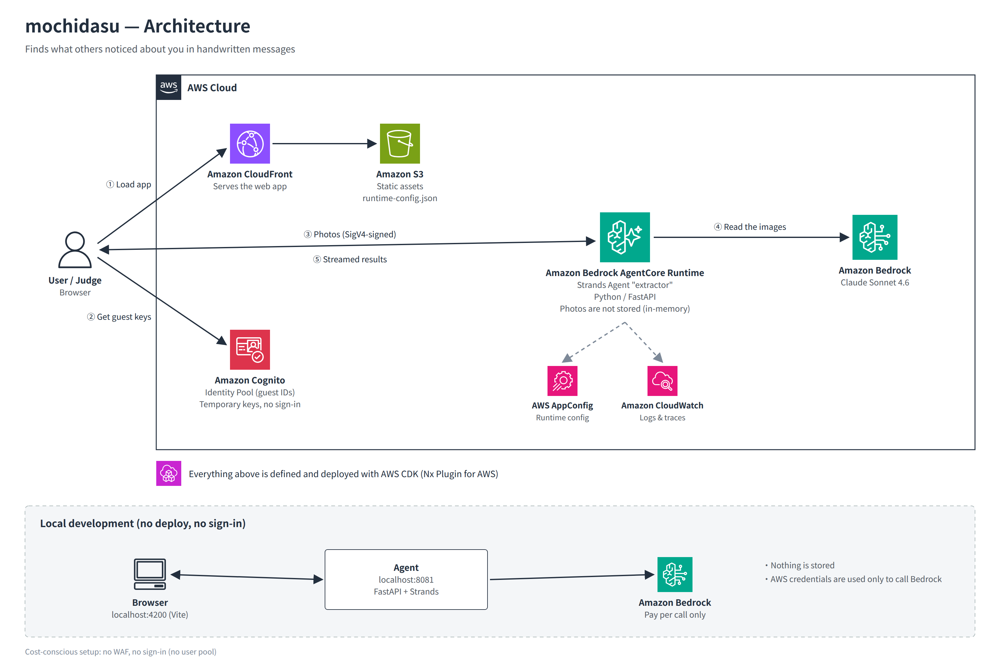

# mochidasu (もちだす)

> **The words that describe you have already been written by someone else.**

Yearbook messages, farewell boards and thank-you cards are full of things other people noticed about you. They usually end up in a box at your parents' house.

**mochidasu** reads photos of those papers and pulls out what you would never write about yourself: traits that **different people, years apart, kept pointing out**. Every line is quoted word for word. The AI never describes you in its own words.

Built for the AWS Builder Center **Zero to Shipped** hackathon · `#personal-expression` · `#startup`

日本語の説明は [README.ja.md](README.ja.md) にあります。

---

## What it does

1. **Read.** Upload photos of message boards or cards. For each one, enter what it is and how many years ago you got it. You can also paste recent messages, such as peer-bonus notes or Slack thanks.
2. **Filter.** Claude on Amazon Bedrock splits the messages by person and keeps only the specific ones. Greetings, set phrases and inside jokes are dropped.
3. **Connect.** Traits mentioned by **two or more different writers** become *"things you take for granted"*. Each one shows the original quotes in time order, plus a few questions that help you recall a recent example of your own.
4. **Take it with you.** One click copies the kept quotes, with their sources, as plain text.

Example from the built-in sample: in the notes to a fictional person, a middle-school classmate (8 years ago), a club friend (4 years ago), a coworker's thank-you card (3 years ago) and a farewell board (this year) all describe the same trait in different words: *"stays until the job is done."*

## What it deliberately does not do

- **It does not rewrite or summarise the messages.** Lines taken from pasted text are checked against the original in code, and any that don't match are dropped.
- **It does not suggest a trait that only one person mentioned.** This is enforced in code, not left to the model.
- **It does not store photos or text.** There are no accounts and no database, and the agent keeps no session history. Results live only in your browser tab.
- **It does not write your self-PR for you.** It gives you the evidence and the questions. You find your own words.

## Architecture



| Layer | Service / library | Notes |
|---|---|---|
| Web | React + Vite, TanStack Router, Tailwind, shadcn/ui | Served from **Amazon CloudFront + S3** (private bucket, OAC) |
| Access | **Amazon Cognito identity pool** (guest identities) | No sign-in. Guests get short-lived credentials that can **only** invoke the agent, and every request is SigV4-signed |
| Agent | **Strands Agents** (Python 3.14, FastAPI) on **Amazon Bedrock AgentCore Runtime** | IAM auth, HTTP streaming, structured output, in-memory only |
| Model | **Claude Sonnet 4.6 on Amazon Bedrock** | Reads handwriting and returns typed JSON (`fragments`, `traits`) |
| Config | AWS AppConfig | Runtime configuration for the agent |
| IaC | **AWS CDK** via **Nx Plugin for AWS** | One stack. The web client is generated from the agent's OpenAPI schema |

To keep hackathon costs low, the stack has no WAF, no user pool and no database.

## Built with coding agents

- **Claude (Cowork):** product design, UI implementation from the design mock, the agent and its verification logic, tests, and debugging. The agent found a HEIC photo failure by driving Chrome on the developer's Mac, then added in-browser HEIC → JPEG conversion.
- **Claude Code + AWS MCP Server (Agent Toolkit for AWS):** local development, deployment and operations against the AWS account.
- **Nx Plugin for AWS MCP server:** scaffolding and generators for the monorepo.

## Getting started

Requirements: Node.js 22+, pnpm 10, [uv](https://docs.astral.sh/uv/) 0.9+, Python 3.14 (stable release), and AWS credentials with access to Claude Sonnet 4.6 on Bedrock.

```bash
pnpm install
uv sync --all-packages

# Run everything locally. No deploy and no sign-in needed; only Bedrock is called
export AWS_PROFILE=<profile> AWS_REGION=<region with Claude enabled>
pnpm nx dev @mochidasu/web          # web on :4200, agent on :8081

# Build, test and deploy
pnpm build                          # lint, typecheck, test, bundle, cdk synth, checkov
pnpm nx bootstrap @mochidasu/infra  # first time only
pnpm nx deploy-sandbox @mochidasu/infra
```

See [docs/development.md](docs/development.md) for details and troubleshooting.

## Repository layout

```
packages/
  web/                 React app (routes: / entry, /upload, /result)
  agent/               Strands agent "extractor" (schema.py, verify.py, agent.py, main.py)
  infra/               CDK app (ApplicationStack)
  common/constructs/   Shared CDK constructs (GuestIdentity, Extractor, Web)
  common/shadcn/       Shared UI components
  common/agent_connection/  Agent runtime helpers (generated)
docs/
  concept.md           Product concept and extraction rules (Japanese)
  decisions.md         Design decisions and why (Japanese)
  development.md       Local dev, deploy, troubleshooting (Japanese)
  architecture/        Architecture diagrams
```

## Roadmap

- Show the actual handwriting: crop each message from the photo so it can be read in the writer's own hand.
- Connect to peer-bonus and thanks tools at work, so the words keep building up week after week instead of arriving once at graduation or a job change.
